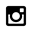

# Language is Dead.

**Networks of languages: the dying ones go missing**

55 similarity networks of human languages were generated from [Wikidata](https://www.wikidata.org/wiki/Wikidata:Main_Page), the largest open, machine-readable knowledge base on the Planet. Each network is missing one language which is marked as endangared by [UNESCO](http://www.unesco.org/languages-atlas/). **The missing language serves to create the title of the respective network.** 55 pieces will be dropped in October 2021. They will be dropped into OpenSea via [Polygon](https://polygon.technology/). Follow @languageisdead on Twitter for drop announcements. **50% of proceeds will be donated to Wikidata, to be used in projects aimed to support the representation of endangered languages and small linguistic communities.**

--- 

**Code**

`languageisdead.R`
- produce artwork.

`produce_languageisdead_Rmd.R`
- abstraction to produce `index.Rmd` and
- render `index.html`.

You will also need the following directories to produce your own:
- `_img/_digital/`
- `_img/_print/`

**Note.** Because this is unique artwork I am not using `set.seed()` anywhere. You will be able to produce your own artwork - formally equivalent to mine - but not my randomness. The works at [languageisdead.net](https://www.languageisdead.net/) were rendered **once**, on 2021/10/15.
